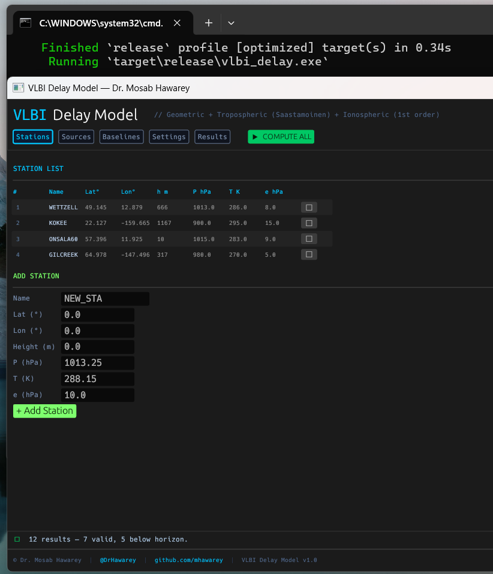
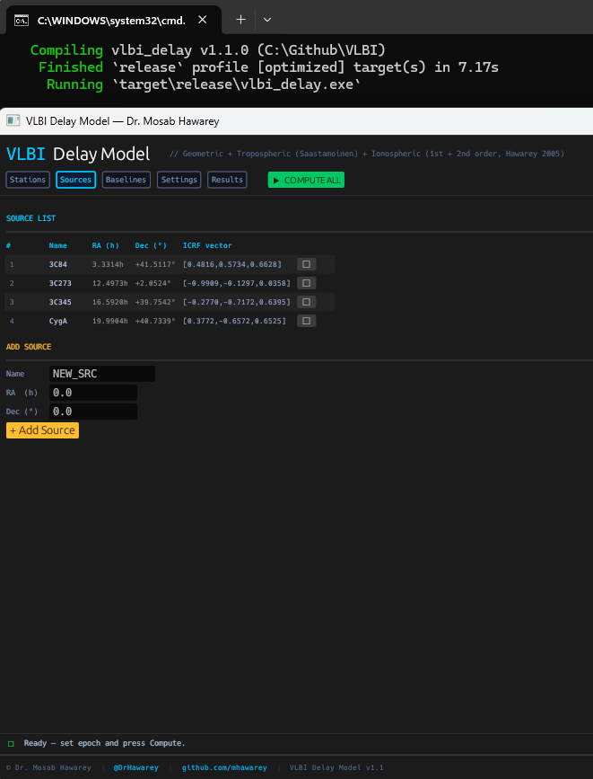
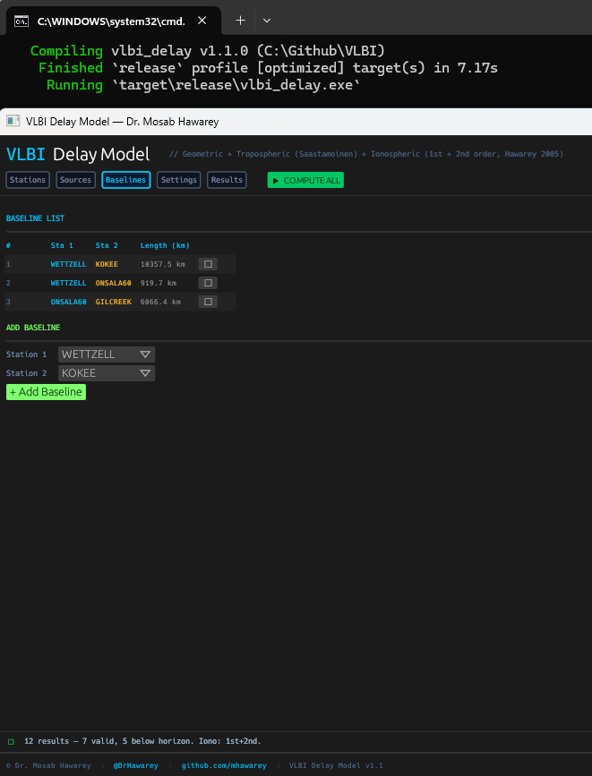
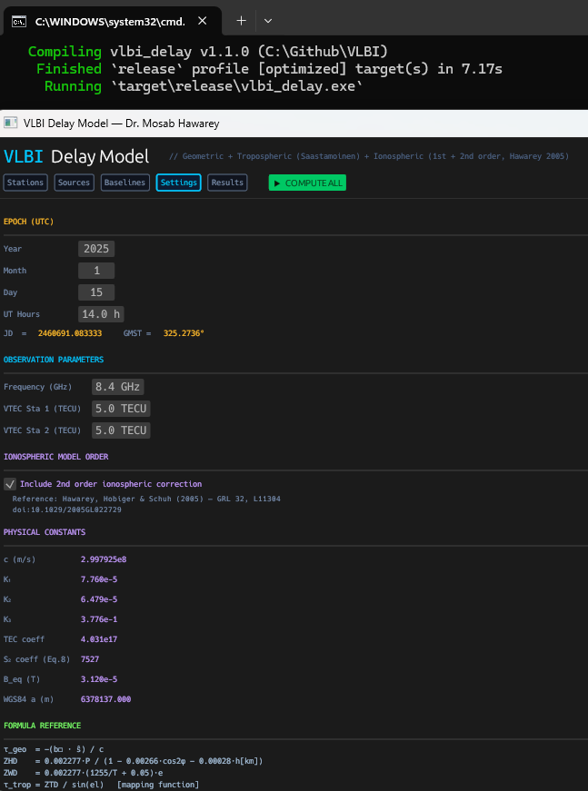
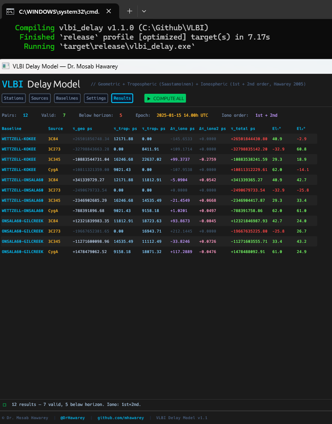

# VLBI Delay Model

[](https://opensource.org/licenses/MIT)

**A native desktop GUI application for computing VLBI interferometric delays — geometric, tropospheric, and ionospheric (1st + 2nd order) — across multiple baselines and radio sources simultaneously.**

**Built in Rust with [egui](https://github.com/emilk/egui) / [eframe](https://github.com/emilk/egui/tree/master/crates/eframe).**

> **v1.1 — adds 2nd order ionospheric correction** following Hawarey, Hobiger & Schuh (2005), *Geophys. Res. Lett.* 32, L11304. **First open-source VLBI delay model to ship a 2nd order ionospheric correction.**

## Screenshots

| Stations Tab | Sources Tab |
|---|---|
|  |  |

| Baselines Tab | Settings Tab |
|---|---|
|  |  |

| Results Tab |
|---|


## Delay Components

| Component | Model | Formula |
|---|---|---|
| **Geometric** | Exact VLBI formula | τ_geo = −(b⃗ · ŝ) / c |
| **Tropospheric** | Saastamoinen (1972) | ZTD / sin(el), with dry + wet |
| **Ionospheric (1st order)** | Thin-shell | K · ΔTEC · sin⁻¹(el) / (f² · c) |
| **Ionospheric (2nd order)** | Hawarey, Hobiger & Schuh (2005) | s · ν⁻³, with s = 7527·c·∫N(B⃗·k̂)dL |
| **Total** | Sum | τ_total = τ_geo + Δτ_trop + Δτ_iono + Δτ_iono2 |

## Features

- **Batch computation** — all (baseline × source) pairs in one click
- **5 tabs**: Stations, Sources, Baselines, Settings, Results
- **Epoch-aware elevation** — GMST / LST / Hour Angle computed per station
- **Add/remove** stations and sources at runtime
- **ECEF preview** per station (WGS84)
- **Color-coded results** — green = valid, yellow = low elevation, red = below horizon
- **Settings** — drag-adjust epoch (year/month/day/UT), frequency, and TEC

## Tropospheric Model (Saastamoinen)

```
ZHD = 0.002277 · P / (1 − 0.00266·cos2φ − 0.00028·h[km])
ZWD = 0.002277 · (1255/T + 0.05) · e
ZTD = ZHD + ZWD
τ_trop = ZTD / sin(el)       [simple mapping function]
```

Required inputs per station: surface pressure P (hPa), temperature T (K), water vapour partial pressure e (hPa).

## Ionospheric Model (1st order)

```
τ_iono = K · ΔTEC / (f² · c)
ΔTEC = TEC₂/sin(el₂) − TEC₁/sin(el₁)   [thin-shell slant TEC]
K = 40.309 × 10¹⁶  [m·Hz²/TECU]
```

## Ionospheric Model (2nd order — Hawarey et al., 2005)

Following equations (3a/3b) and (8) of *Hawarey, Hobiger & Schuh (2005), GRL 32, L11304*:

```
s      = 7527 · c · ∫ N · (B⃗ · k̂) dL          [Eq. 8]
τ_2    = s · ν⁻³                                 [Eq. 3a/3b]
Δτ_2   = τ_2,sta2 − τ_2,sta1                    [Section 3]
```

The integral is evaluated along the line of sight at 100 representative
points between 100 km and 1000 km altitude (faithful to the paper, Section
3, step 1). The geomagnetic field B⃗ is taken from a tilted IGRF-style
dipole — avoiding the centred-dipole and 400-km thin-shell approximations
that the 2005 paper showed introduce ≥ 10% error. The electron density N
is modelled with a Chapman-α profile peaked at 350 km (PIM stand-in).

Toggle this term on/off via the **Settings** tab (default: **on**).

## Epoch & Elevation

```
GMST   = 280.46061837 + 360.98564736629 · (JD − 2451545.0)
LST    = GMST + λ_station
HA     = LST − RA_source
sin(el)= sin(φ)·sin(δ) + cos(φ)·cos(δ)·cos(HA)
```

## Default Stations

| Station | Lat (°) | Lon (°) | h (m) |
|---|---|---|---|
| WETTZELL | 49.145 | 12.879 | 666 |
| KOKEE | 22.127 | −159.665 | 1167 |
| ONSALA60 | 57.396 | 11.926 | 10 |
| GILCREEK | 64.978 | −147.496 | 317 |

## Build & Run

### Prerequisites
```
Rust ≥ 1.75 (stable)
```

On Linux, also install:
```bash
sudo apt install libxcb-render0-dev libxcb-shape0-dev libxcb-xfixes0-dev \
                 libxkbcommon-dev libssl-dev pkg-config
```

### Build
```bash
cargo build --release
./target/release/vlbi_delay
```

On Windows, double-click `run.bat`.

### Tests
```bash
cargo test
# 10 passed; 0 failed
#   — 5 baseline tests (geometry, tropo, iono 1st order)
#   — 5 dedicated 2nd-order ionospheric tests, validated against
#     Hawarey, Hobiger & Schuh (2005) Table 1 baselines
#     (Algonquin–Hartebeesthoek, Kokee–NyAlesund, ν⁻³ scaling, antisymmetry)
```

## References

- Sovers, O.J., Fanselow, J.L. & Jacobs, C.S. (1998). Astrometry and geodesy with radio interferometry. *Rev. Mod. Phys.* 70(4):1393.
- Saastamoinen, J. (1972). Atmospheric correction for the troposphere and stratosphere. *AGU Geophys. Monogr.* 15:247–251.
- Spilker, J.J. (1994). Tropospheric effects. In: *Global Positioning System: Theory and Applications*, Vol. 1.
- Bassiri, S. & Hajj, G.A. (1993). Higher-order ionospheric effects on the GPS observables. *Manuscripta Geodaetica* 18:280–289.
- **Hawarey, M., Hobiger, T. & Schuh, H. (2005). Effects of the 2nd order ionospheric terms on VLBI measurements.** *Geophys. Res. Lett.* 32, L11304. [doi:10.1029/2005GL022729](https://doi.org/10.1029/2005GL022729). — *implemented in this software (v1.1)*

## Note on the 2nd order ionospheric correction

To our knowledge, this software is the **first open-source VLBI delay
model to incorporate the 2nd order ionospheric correction** as derived
in Hawarey, Hobiger & Schuh (2005). Operational VLBI software packages
(OCCAM, Calc/Solve, VieVS) historically apply only the 1st order
correction and treat 2nd order effects as negligible at the
sub-millimetre level. With international space geodesy now targeting
sub-millimetre baseline accuracy, the 2nd order term — at the few-psec
per-baseline scale — becomes relevant.

## Author

**Dr. Mosab Hawarey**
>
PhD, Geodetic & Photogrammetric Engineering (ITU) | MSc, Geomatics (Purdue) | MBA (Wales) | BSc, MSc (METU)

- GitHub: https://github.com/mhawarey
- Personal: https://hawarey.org/mosab
- ORCID: https://orcid.org/0000-0001-7846-951X

## License

MIT License
